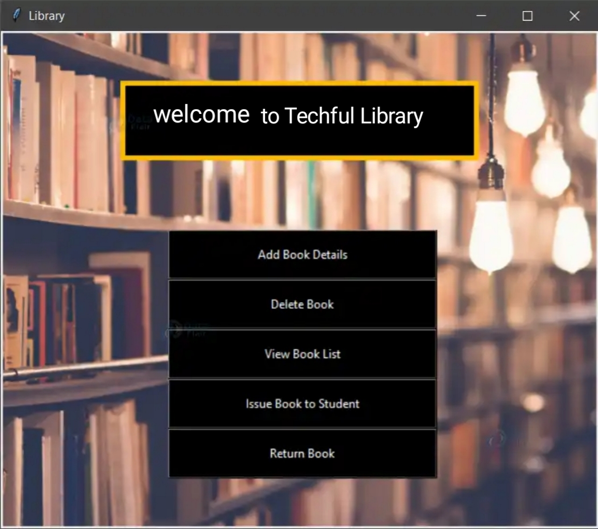
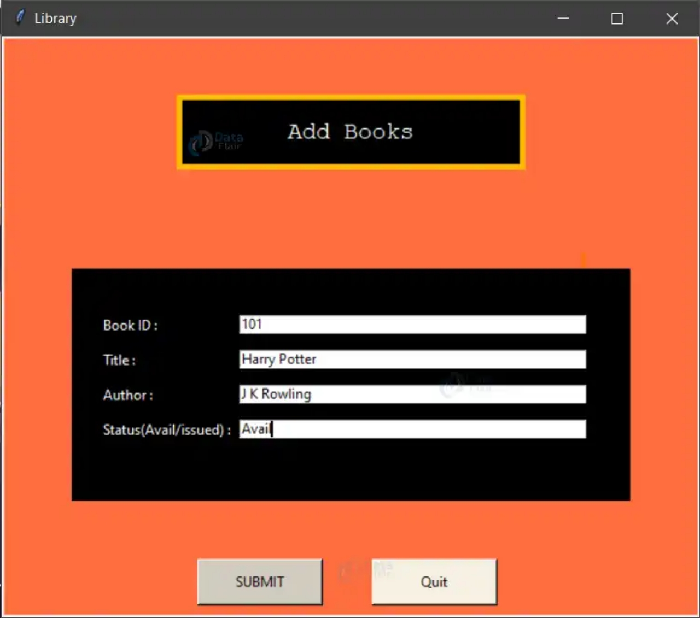
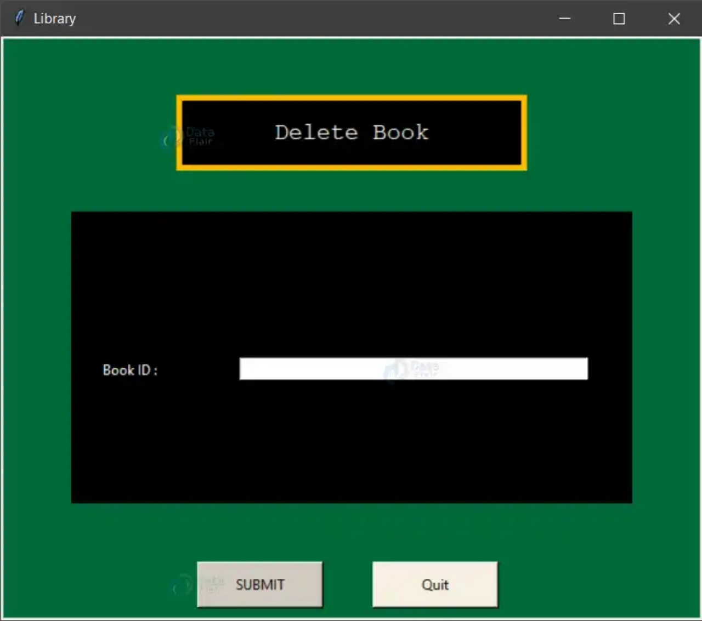
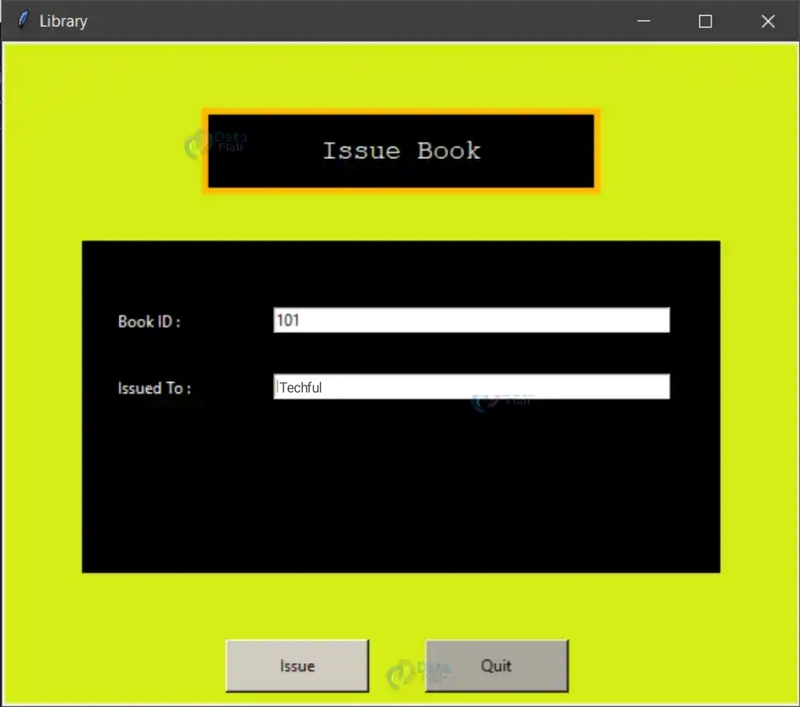
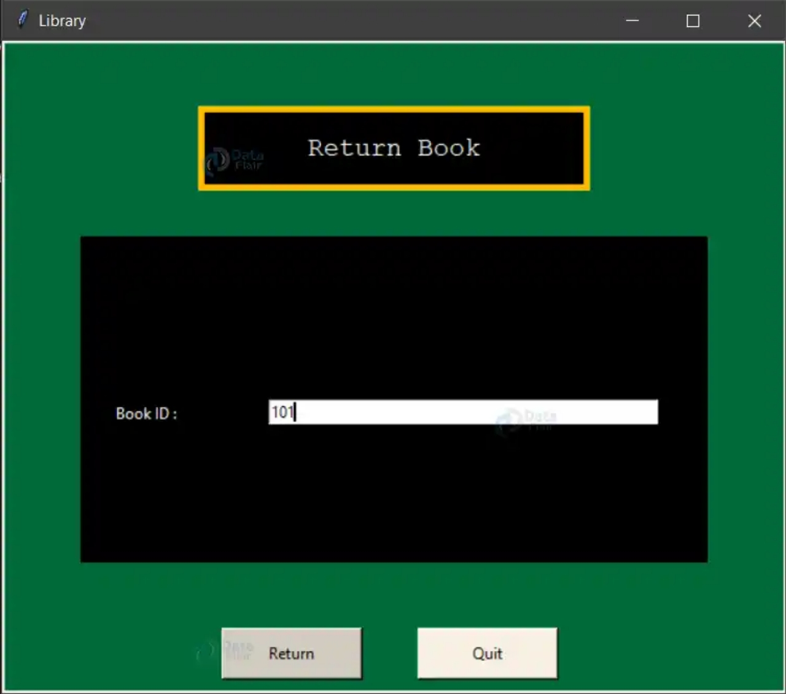

##  techful_library


### Techful README [](https://github.com/sindresorhus/awesome#readme)
> Enrich your with ideas !

A library management software where you can view all the book present in your library, issue books to studen. 📚

### Links

[Github](https://github.com/sotoriz)       
[project](https://sotoriz.github.com/landing.html)              
[project blog](https://medium.com/)       
[LinkedIn](https://https://www.linkedin.com/in/sotonye-orifama-6520bab0)
                
### 👉 If you like this repo then please give it a ⭐️

### Short Description
This is a software which can efficiently manage your library. This app keeps track of the books present in the library -

* Add a new book(s)
* Delete any book
* View all the books in the library
* Issue book to student
* Accept books Return by student 

###  Screenshots

     

     ## NOTE:
This project is subject to change by the developer and is still in development

### Installations
The following packages are required or should be installed for the project.

	tkinter - pip install tkinter
	Pillow - pip install pillow
	PyMySql - pip install pymysql

### Description of Tables

   Create Tables
   create database db;

create table books(bid varchar(20) primary key, title varchar(30), author varchar(30), status varchar(30));

create table books_issued(bid varchar(20) primary key, issuedto varchar(30));

### How to run this

Running this is as simple as it gets. Follow this steps
1. Clone this repository
2. Double click on `main.py`

###  Contributing

Contributions are always welcome! Please read the `contribution guidelines` first.

###  Related projects

Library Management System – Python Project by Bartleby.com

### Licensing

This project is licensed under the MIT license. Feel free to edit and distribute this template as you like.

See `LICENSE` for more information.

```Copyright 2023 sotonye orifama

Getting Started

For help getting started with tkinter, view our online [documentation](https://docs.python.org/2/library/tkinter.html).
